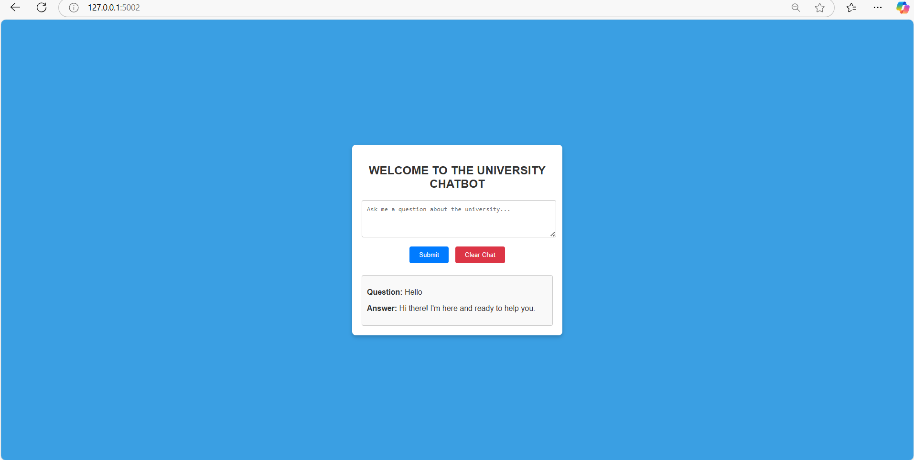

# Chatbot_project

A flask (Python)

#### Basic Features

#### Chatbot_project
* Shows how much text content is positive

### Prerequisites

This app is built using **Python 3.6.6**

## Start Service
Now, to start the application, do the following:

    python app.py

Server will start and  you can connect by opening the web browser and connecting one of the URLs:

    http://127.0.0.1:5002/

### Some Screenshots

